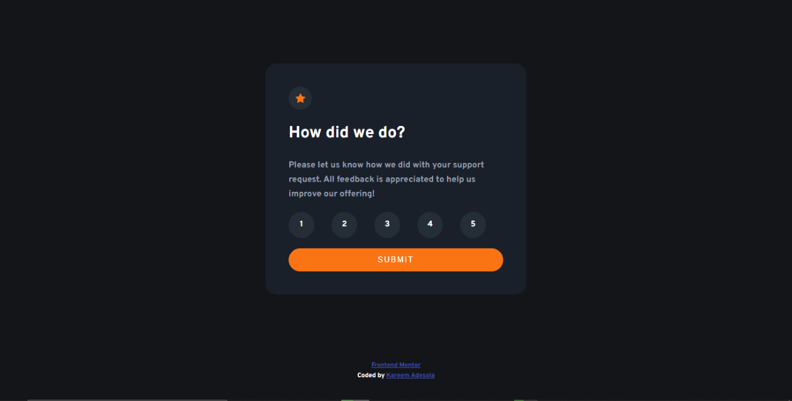
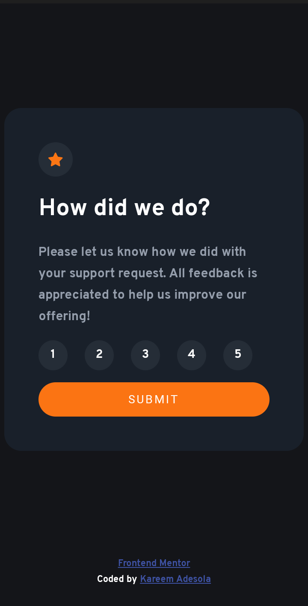

# Frontend Mentor - Interactive rating component solution

This is a solution to
the [Interactive rating component challenge on Frontend Mentor](https://www.frontendmentor.io/challenges/interactive-rating-component-koxpeBUmI)
. Frontend Mentor challenges help you improve your coding skills by building realistic projects.

## Table of contents

- [Overview](#overview)
    - [The challenge](#the-challenge)
    - [Screenshot](#screenshot)
    - [Links](#links)
- [My process](#my-process)
    - [Built with](#built-with)
    - [What I learned](#what-i-learned)
    - [Continued development](#continued-development)
    - [Useful resources](#useful-resources)
- [Author](#author)
- [Acknowledgments](#acknowledgments)

## Overview

### The challenge

Users should be able to:

- View the optimal layout for the app depending on their device's screen size
- See hover states for all interactive elements on the page
- Select and submit a number rating
- See the "Thank you" card state after submitting a rating

### Screenshot

| Desktop                                                         | Mobile                                                        |
|-----------------------------------------------------------------|---------------------------------------------------------------|
|           |           |
|       |       |
|  |  |

### Links

- Solution URL: [Solution URL here](https://github.com/kareemadesola/interactive-rating-component)
- Live Site URL: [Live site URL here](https://kareemadesola.github.io/interactive-rating-component/)

## My process

### Built with

- Semantic HTML5 markup
- CSS custom properties
- Flexbox
- CSS Grid
- Mobile-first workflow
- BEM Methodology

### What I learned

#### HTML

- Surrounding where to insert value of selected button with a span
  ```html
          <p class="success__value">You selected <span class="span__value"></span> out of 5</p>
  
  ```

#### CSS

- Use CSS flex `outline:none`, `cursor:pointer`,`border:none` and `flex-direction:column` properties
  ```css
  .container {
    display: flex;
    justify-content: center;
    align-items: center;
  }
  ```

#### JavaScript

- Use `addEventListener` to remove or add classes to the elements when element is clicked

### Continued development

- Use more of CSS flexbox in future projects to be more proficient with its concepts

### Useful resources

- [kenneth0417](https://github.com/kenneth0417/Interactive-Rating-Component) - His solution helped me understand how to
  implement the requested behavior.

## Author

- Frontend Mentor - [@kareemadesola](https://www.frontendmentor.io/profile/kareemadesola)
- Twitter - [@kareemadesola](https://twitter.com/KareemOluwa)

## Acknowledgments

I would like to give a hat tip to [kenneth0417](https://github.com/kenneth0417/Interactive-Rating-Component) as his
solution gave an insight on how to build my project
